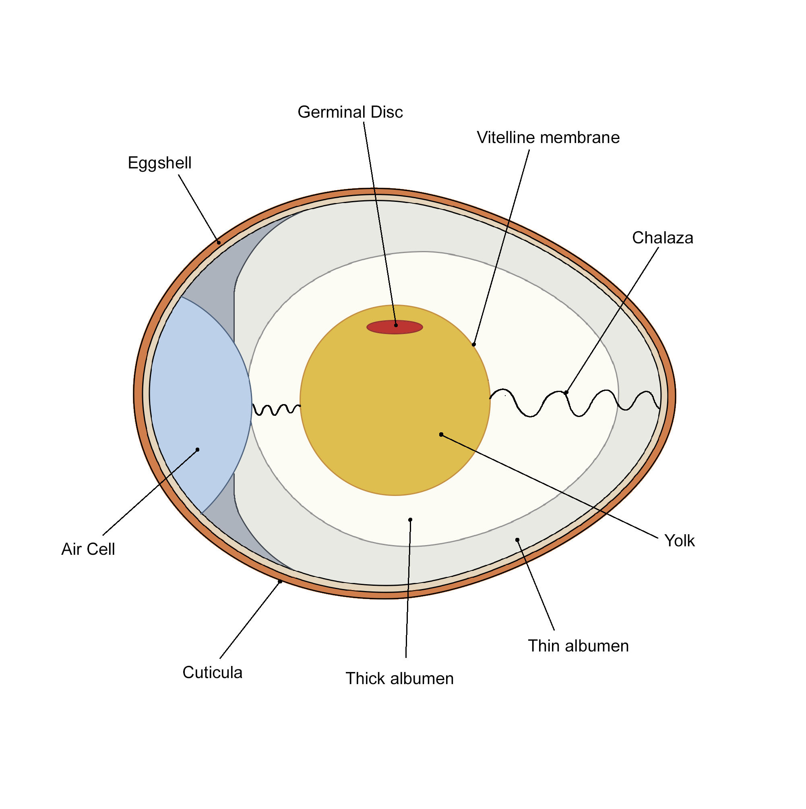

### Theory

Hens, scientifically known as Gallus gallus domesticus, are oviparous animals that reproduce by laying eggs. Fertilization occurs inside the body, but further development takes place outside after the egg is laid. The egg is laid within 22-24 hours after its formation, passing through the oviduct and shell gland (in the uterus).

#### Structure of egg :

 

The egg of a hen is polytelic (containing a large amount of yolk).

#### The structure of the egg mainly consists of:

* <b>Egg Shell :</b> An eggshell is the outer covering of an egg. It is white, porous, and allows the exchange of gases through it.

* <b>Air Cell :</b> The egg has a fat rounded end and a pointed cone end. The air cell is typically located at the large rounded end of the egg, between the outer and inner membranes. It forms as the egg cools and its contents contract, and as moisture evaporates after the egg is laid.

* <b>Shell Membrane :</b> Beneath the shell, there are two thin shell membranes. The first one, located closest to the shell, adds support. The second one envelops the egg white and eventually separates from the first membrane as the egg ages.

* <b>Vitelline membrane :</b> It is a multilayered structure that protects and gives shape to the egg yolk, separating it from the egg white.

* <b>Yolk :</b> The egg yolk is the nutrient-rich part of the egg and is yellowish in color.

* <b>Germinal Disc :</b> The little white spot present on the yolk is the germinal disc or blastodisc. It is where fertilization occurs and is responsible for chick embryo development.

* <b>Chalaza :</b> On opposite sides of the yolk are two twisted, whitish cord-like objects known as chalazae. Their function is to support the yolk in the center of the albumen.

* <b>Albumin or Egg white :</b> It is the clear liquid contained within an egg. The white provides cushioning and additional nutrition for the developing chick and contains less nutrition than the yolk.

These structures work together to provide the necessary environment and nutrients for the development of a chick embryo inside the egg.